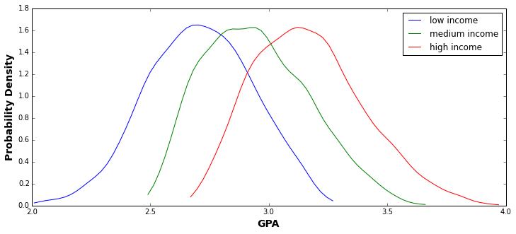

## Part 0: Quick Review of Distributions

The following is a short review of the distributions.


```
Discrete:

    - Bernoulli
        * Model one instance of a success or failure trial (p)

    - Binomial
        * Number of successes out of a number of trials (n), each with probability of success (p)

    - Poisson
        * Model the number of events occurring in a fixed interval
        * Events occur at an average rate (lambda) independently of the last event

    - Geometric
        * Sequence of Bernoulli trials until first success (p)


Continuous:

    - Uniform
        * Any of the values in the interval of a to b are equally likely

    - Gaussian
        * Commonly occurring distribution shaped like a bell curve
        * Often comes up because of the Central Limit Theorem (to be discussed later)

    - Exponential
        * Model time between Poisson events
        * Events occur continuously and independently
```


## Part 1: Identifying Distributions

Often we have to identify what distribution we should use to model a real-life
situation. This exercise is designed to equip you with the ability to do so.

For each question:

- Name the most appropriate distribution and the associated parameter(s)

- Set up equation for the distribution, e.g.

  ```
  Let X be the number of heads in 30 coin flips:
  X ~ Binomial(n=30, p=0.5)
  ```

- Calculate the answer, e.g. ```P(X = 15) = 0.144``` or ```E(X) = 15```
  depending what the question is asking. Look up the PMF / PDF equation of the
  distribution in the lecture, [here](images/kepletek.pdf), or wikipedia.

<br>

1. A typist makes on average 2 mistakes per page.

   What is the probability of a particular page having no errors on it?


2. Components are packed in boxes of 20. The probability of a component being
   defective is 0.1.

   What is the probability of a box containing 2 defective components?


3. Patrons arrive at a local bar at a mean rate of 30 per hour.

   What is the probability that the bouncer has to wait more than 3 minutes to card the
   next patron?


4. A variable is normally distributed with a mean of 120 and a standard
   deviation of 5. One score is randomly sampled.

   What is the probability the score is above 127? Use scipy.stats.norm to perform the calculation.

5. You need to find a tall person, at least 6 feet tall, to help you reach
   a cookie jar. 8% of the population is 6 feet or taller.

   If you wait on the sidewalk, how many people would you expect to have passed
   you by before you'd have a candidate to reach the jar?


6. A harried passenger will be several minutes late for a scheduled 10 A.M.
   flight to NYC. Nevertheless, he might still make the flight, since boarding
   is always allowed until 10:10 A.M., and boarding is sometimes
   permitted up to 10:30 AM.

   Assuming the extended boarding time is **uniformly distributed** over the above
   limits, find the probability that the passenger will make his flight,
   assuming he arrives at the boarding gate at 10:25.


## Part 2: Covariance and Joint Distribution

**Covariance** is a summary statistic that measures how much two variables vary together. For example,
the covariance is positive when high values of X co-occur frequently with high values of Y.
The covariance is negative when high values of X co-occur frequently with low values of Y.
The covariance is zero when the values of X co-occur randomly with values of Y.
Similar to correlation, covariance measures the strength of the linear relationship (though it is unscaled).

The **joint PMF** of two discrete random variables X and Y describes how much the probability mass is
placed on each possible pair of values (x, y).

Similarly, the **joint PDF** of two continuous random variables X and Y describes the relatively likelihood
placed on the pair of possible values (x, y).  The idea is similar to the discrete case, but as the values are
continuous, it makes more sense to think of the continuous rv's as falling into a two-dimensional set (such as a
rectangle) obtained through integration.

<br>

Suppose a university wants to look for factors that are correlated with the GPA of the students that they
are going to admit.

1. Load the data file `data/admissions.csv` into a pandas dataframe. The columns are `gpa`, `family_income`
   and `parent_avg_age`.

2. Implement a `covariance` function and compute the covariance matrix of the dataframe. Check your results
   with `df.cov()`. Make sure you understand what each of the numbers in the matrix represents

3. Implement a `normalize` function that would compute the correlation matrix from the covariance matrix.
   Check your results with `df.corr()`

4. You should identify `family_income` as being the most correlated with GPA. The university wants to make
   an effort to make sure people of all family income are being fairly represented in the admissions process.
   In order to achieve that, different GPA thresholds will be set according to family income.

   The low, medium and high family income groups are `0 to 26832`, `26833 to 37510` and `above 37510` respectively. 
   Implement a function that would plot the distribution of GPA scores for each family income category. These are the
   conditional probability distributions of `gpa` given certain levels of `family_income`.

   **Hint:**
   - **You can use the** [kde fit function](http://glowingpython.blogspot.com/2012/08/kernel-density-estimation-with-scipy.html)
     **to fit a curve to the histogram produced from the data.**

   

6. If the university decides to accept students with GPA above the 90th percentile within the respective family
   income categories, what are the GPA thresholds for each of the categories?

## Part 3: Pearson Correlation vs Spearman Correlation

The Pearson correlation you have encountered in `Part 2` evaluates the linear relationship between two continuous
variables. The Spearman correlation evaluates the monotonic relationship between two continuous or ordinal variables
without assuming linearity of the variables. Spearman correlation is often more robust in capturing non-linear relationship
between variables.

1. In addition to the `family_income` and `parent_avg_age`, you are also given data about the number of hours the
   students studied. Load the new data in from `data/admissions_with_study_hrs_and_sports.csv`.

2. Make a scatter plot of `hrs_studied` versus `gpa`, with `hrs_studied` on the x-axis. 
   Make the points more transparent so you can see the density of the points. Use the following command get the slope 
   and intercept of a straight line to fit the data : 
   `slope, intercept, r_value, p_value, std_err = scipy.stats.linregress(gpa, hrs_studied)`. 
   Plot the straight line on the scatter plot.

3. Use the functions `scipy.stats.pearsonr` and `scipy.stats.spearmanr` to compute the Pearson and Spearman correlation
   coefficients between `gpa` and `hrs_studied`. What is the difference between the two coefficients?
   Can you explain why they are different?

4. Repeat step `2` and `3` for `gpa` and `sport_performance`. Is there a strong relationship between the two variables?
   Do the correlation coefficients reflect that? Explain your answer.


## Part 4: Distribution Simulation

Often times in real life applications, we can specify the values of a variable to be of a particular distribution,
for example the number of sales made in the next month can be modeled as a uniform distribution over the range of
5000 and 6000.

In this scenario, we are modeling `profit` as a product of `number of views`, `conversion` and `profit per sale`,
where `number of views`, `conversion` and `profit per sale` can be modeled as probabilistic distributions.
By randomly drawing values from these distributions, we are able to get a distribution of the range of `profit`
based on the uncertainties in the other variables.

`Profit = Number of views * Conversion * (Wholesale_Proportion * 50 +
(1-Wholesale_Proportion)*60)`

Assumptions:
- `Number of views` is a uniform distribution over the range of 5000 and 6000
- `Conversion` is a binomial distribution where the probability of success is `0.12` for each sale among the
  `Number of views` made
- `Profit per sale` has `0.2` probability of taking the value `50` (for wholesale) and `0.8` of
  taking the value `60` (non-wholesale) _for each sale_, so you should use a binomial to model the number of the total sales that happen at wholesale.

1. Given the distributions of each of variables, use scipy to write a function that would draw random values from each of the
   distributions to simulate a distribution for `profit`

2. Compute the range of values of `profit` where the middle 95% of the probability mass lies.

## Extra Credit: More Probability Exercises

### Sets

1. Out of the students in a class, 60% are geniuses, 70% love chocolate,
   and 40% fall into both categories. Determine the probability that a
   randomly selected student is neither a genius nor a chocolate lover.

### Combinatorics

1. A fair 6-sided die is rolled three times, independently. Which is more likely: a
   sum of 11 or a sum of 12?

2. 90 students are to be split at random into 3 classes of equal size. Joe and Jane are
   two of the students. What is the probability that they end up in the same
   class?

3. A well-shuffled 52-card deck is dealt to 4 players. Find the probability that
   each of the players gets an ace.

### Random Variables

1. A six-sided die is loaded in a way that each even face is twice as likely as
   each odd face. All even faces are equally likely, as are all odd faces.

   Construct a random variable for a single roll of this die and find the
   probability that the outcome is less than 4.

2. `X` is a random variable with PMF `p(k) = k^2/a` if `k = -3, -2, -1, 0, 1, 2, 3`
and `p(k) = 0` otherwise.

  (a) Find `a` and `E[X]`

  (b) Find the pmf of the random variable `Z = (X - E[X])^2`

  (c) Using the result from (b), find the variance of `X`

3. A soccer team has 2 games scheduled for one weekend. It has a 0.4 probability
   of not losing first game and 0.7 probability of not losing the second
   game, independent of the first. If the team doesn't lose a particular game, the
   team is equally likely to win or tie. The team will receive 2 points for a win,
   1 for a tie, and 0 for a loss.
   - Find the PMF of the number of points that the team earns over the
     weekend.
   - Find the expected value for the number of points earned.
   - Find the variance for the number of points earned.

4. You have 5 keys, one of which is the correct one for the house. Find the PMF
   of the number of trials you will need to open the door, assuming that after
   you try a key that doesn't work you set it aside and you otherwise randomly
   select a key to try next.


5. You toss independently a fair coin and you count the number of tosses until
   the first tail appears. If this number is `n`, you receive `2^n` dollars.
   What is the expected amount you will receive? How much would you be willing
   to play this game?

### Joint Distributions

1. A class of `n` students takes a test consisting of `m` questions. Suppose that
   student `i` submitted answers to the first `m_i,` for `m_i <= m` questions.
   - The grader randomly picks one answer, call it `(I, J)` where `I` is the student
     ID number (values `1,...,n`) and `J` is the question number (values `1,...,m`).
     Assume that all answers are equally likely to be picked. Calculate the joint
     and marginal PMFs of `I` and `J`.

   - Assume that an answer to question `j` if submitted by student `i` is correct
     with probability `p_ij`. Each answer gets `a` points if it is correct and `b`
     points otherwise. Find the expected value of the score of student `i`.

### Independence

1. Alice and Bob want to choose between the opera and the movies by tossing a
   coin. Unfortunately, the only coin they have is biased, though the bias is
   not known exactly. How can they use the biased coin to make a decision so
   that either option (opera or movies) is equally likely to be chosen?

2. A system consists of `n` identical components, each of which is operational
   with probability `p`, independent of other components. The system is
   operational if at least `k` out of the `n` components are operational. What is
   the probability that the system is operational?

### Covariance and Correlation

1. Suppose that *X* and *Y* are random variables with the same variance. Show
   that *X - Y* and *X + Y* are uncorrelated.
