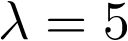

# Estimation and Distribution Fitting

## Part 1: Distribution Selection

In some scenarios selecting a family of distributions that will appropriately
model the random variable we are interested in is easy. E.g. Binomial
distributions model the number of heads in 50 flips of a fair (or unfair) coin.
In other scenarios, however, distribution selection is not as obvious. In such
cases, plotting the data and some distributions from the family often helps.

In this exercise the random variable is the **amount of rainfall
in a given month** and the mechanism that controls the random variable is
unclear. 

<br>

1. The file `data/rainfall.csv` contains rainfall data for Nashville
   measured since 1871. Load the data into a dataframe.

2. Plot a histogram of *January's* rainfall. After evaluating the data
   characteristics, identify which two of the following candidate distribution
   families below would be appropriate models for the data and explain why.

   <div align="center">
      
   </div>

## Part 2: Method of Moments

**Method of Moments (MOM)** estimates the parameters of a distribution (modelling a population) based on sample moments (in most cases, the sample mean and sample variance).  

The ***method of moments*** simply equates the sample moments to their population counterparts. 

<br>

1. Use **MOM** to compute the parameters for the two distributions selected
   in the previous question as follows:

   - Calculate the **sample mean** and **sample variance**.

   - For the two distribution families under consideration as models for
     rainfall, locate the formulae relating the distribution parameters to the
     population mean and population variance. 

   - The sample mean and the sample variance are not the same as the population
     mean and the population variance, but we can use the sample computations
     as estimates of the population quantities. By equating the sample mean and
     variance to the population mean and variance, compute and state the
     **MOM** estimate of the distribution parameters. 

   - Plot the two distributions with the computed parameters over the histogram
     of January rainfall data.
        - Use `normed=1` to plot a histogram on a probability density scale.
        - Use, e.g., `norm(mean, stdev).pdf(np.linspace(left, right))` to trace 
	  the distribution's probability density function (pdf).

**Hint:**

Some distribution families are directly parameterized by the population mean and variance (the normal family is like this), for others, the population mean and variance are functions of these quantities.  In the second situation, you will have to *solve* of the parameters of the family <sup>[1](#gamma-footnote)</sup>.


   - The pdf for the gamma function can be written as follows:
     
     
   - The mean and variance of this parameterization are:
   
     
     
   - The population parameters can therefore be estimated using 
     **MOM** by substituting the sample mean and sample variance 
     into the formulas and solving for alpha and beta: 

2. It is common (and effective) practice to decide how well a distribution fits data via graphing. Do you feel the gamma or the normal distribution is a better fit for the data <sup>[2](#ks-test)</sup>? 

3. Now let's do what we have done for January for every month: loop over all 
   the months and create the same plot (of a histogram with an overlay of the 
   preferred data model) for each month. 
   
   **Here is some [code](plot_grid_stub.md) to help get you started with a 
   grid plot structure for the monthly plots.  Make sure you read through 
   and understand the code and thoroughly if you're not quite sure how to  
   get multiple subplots on one figure.**

   


## Part 3: Maximum likelihood Estimation

**Maximum likelihood Estimation (MLE)** chooses the parameter(s) that maximize
the likelihood of observing our given sample (under our choice of
distributional family). 

The **likelihood function** of a family of distributions is just the family of
density functions, but instead of viewing the parameters as fixed and the data
as random, we instead view the **data as fixed and known** and the **parameters
as variable and unknown**. 

The idea is that as we try out different possibilities for the parameters, the
likelihood function reports how reasonable those parameters are given the fixed
and known data we have collected.  The **most reasonable** parameters are the
ones that maximize the likelihood.  These are called the **maximum likelihood
estimates**.

**Note:** MLE and MOM give you estimates of parameters under a given assumed 
distributional family. If the chosen distribution inherently does not fit the
data well, conducting MLE and MOM are a fools errand. 

<br>

1. Given data drawn from a Poisson distribution, where
  , use the `.pmf()`
  method to calculate the probability of observing a value of **6**.

  Create a function `likelihood(x, lambda)` that takes in a lambda and
  a discrete data value, and returns the probability of observing the 
  discrete value given the particular lambda.

  **Note:** This function is returning probabilities of data given a parameter 
  choice. When we hold the data fixed and try different values for the 
  parameter, the comparison of the values is called the likelihood.  That is 
  why our function is called `likelihood()`.

2. Using numpy,
  [read the file](http://docs.scipy.org/doc/numpy/reference/routines.io.html)
  `data/poisson.txt` into a numpy array.

3. For a continuous range of lambda from 1 - 17 (use `np.linspace()`)
   calculate the likelihood (of the parameter) given the data. 

   You may assume the data are iid (independent and identically distributed)
   so that, e.g., (the probability of two data points can be calculated as) 
   `Pr(X=x,Y=y) = Pr(X=x)Pr(Y=y)` for a given choice of the parameter. 

   Note that as the number of data points increases, more and more
   probabilities will need to be multiplied together.  While this is
   theoretically appropriate, it will eventually be numerically infeasible.  A
   clever solution to this is to take the log (`np.log10`) of the product and
   sum log probabilities rather than multiply probabilities.
   
   Since the log function is monotonically increasing, the biggest possible
   sum of log probabilities will have a one to one correspondence with the 
   biggest possible product of probabilities. Specifically, it is the same 
   value of the parameter(s) that will achieve maximums in both setups.

4. Our objective is to compare the likelihoods for different values of 
   the parameters and choose the parameter that has the largest likelihood.
   Plot the log likelihoods over the range of considered lambda values and
   determine the lambda which produces the maximum likelihood: this is our MLE
   point estimate.

   <div align="center">
     
   </div>
   
   Is this what you expected?  See [9.0.1 Poisson Example](http://statweb.stanford.edu/~susan/courses/s200/lectures/lect11.pdf)

5. Returning to the rainfall data, find the maximum likelihood estimates of the
   alpha and beta for the gamma distributions.

   Scipy has a `fit()` method to find the MLE estimates for our data:

   ```python
    # Set the floc=0 for the method, this simply keeps the gamma
    # distribution's location fixed at 0

    ahat, loc, bhat = scipy.stats.gamma.fit(df[month], floc=0)
    alpha_mle, beta_mle = ahat, 1.0/bhat
    ```
   Using the MLE estimates for alpha and beta, plot the MLE estimated Gamma
   distribution on the same plot as the method of moments.

   Would you use the MOM or MLE estimates to parameterize your distributions
   for this data set?

   Explain your answer.

   <div align="center">
     
   </div>

   [**Save**](http://matplotlib.org/api/pyplot_api.html#matplotlib.pyplot.savefig)
   **this figure** as ``mom_mle.png``.

## Part 4: Non-parametric Estimation

In some instances we may be interested in a more flexible approach.

In such cases we can estimate the distribution *non-parametrically* (i.e.
making no (or pedantically, only very weak) assumptions about the form of the
underlying distribution) using **kernel density estimation**.

<br>

To see how this works let us create a bi-modal normal distribution that is
not (easily) described by any single off-the-shelf parametric distribution.

1. Using scipy, create two normal distributions with different locations (mean)
   and scales (standard deviation):  `Normal(0, 2)` and `Normal(4, 1)`.

2. Take 500 samples from each distribution and store them into a single array
   (or list). This has the effect of 'merging' our two distributions.

3. Plot a histogram of this merged distribution and try to identify if the 
   two peaks are where you would expect them to be.

   <div align="center">
     
   </div>

4. Using the scipy
   [kde](http://docs.scipy.org/doc/scipy-0.13.0/reference/generated/scipy.stats.gaussian_kde.html)
   function [calculate a nonparametric representation of the data distribution](http://glowingpython.blogspot.com/2012/08/kernel-density-estimation-with-scipy.html). Overlay this non-parametric distribution on top of the histogram
   of the data.

   <div align="center">
     
   </div>

5. Consider some of the advantages and disadvantages of using a non-parametric 
   model as opposed to a parametric model. State at least one application where
   each is more appropriate than the other.


### Footnotes

<a name="gamma-footnote">[1]</a> The Gamma distribution has two common parameterizations. The Gamma [Wikipedia](https://en.wikipedia.org/wiki/Gamma_distribution) page has a table comparing the two versions. They are *almost* equivalent, but instead of alpha and beta notation the other parameterization uses k and theta. The k and alpha parameter are equivalent between the two parameterizations and can be thought of as 'shape' parameters, and theta is the inverse of beta, so beta parameterizes the 'rate' of the distribution while theta is the more familiar 'scale' of the distribution. The `scipy.stats.gamma` uses the k and theta version, but refers to these as `a` and `scale`.

<a name="ks-test">[2]</a>  We can use the
[Kolmogorov-Smirov](http://en.wikipedia.org/wiki/Kolmogorov%E2%80%93Smirnov_test)
test to evaluate your fit using
[scipy.stats.kstest](http://docs.scipy.org/doc/scipy-0.14.0/reference/generated/scipy.stats.kstest.html).
If you have time after the other sprint problems come back and try this out to
see if it confirms your feelings regarding distrbution choice for the rainfall
data. 
