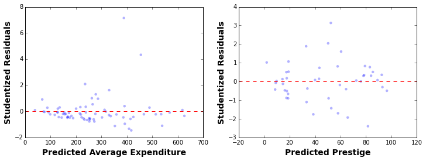
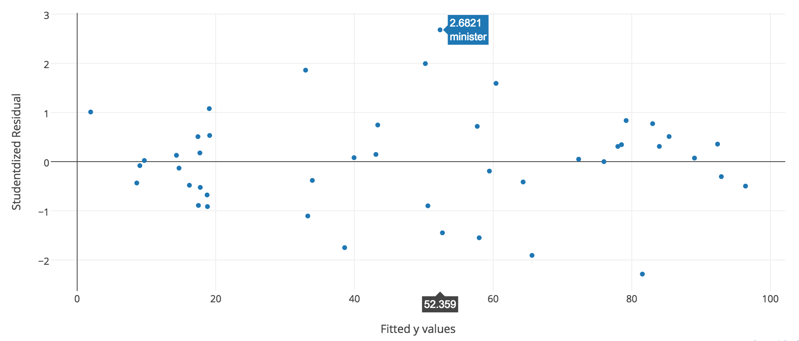
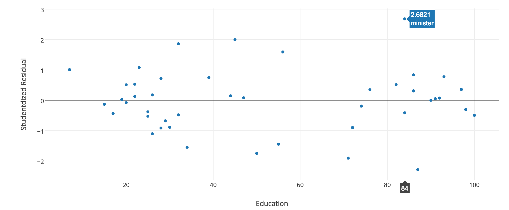
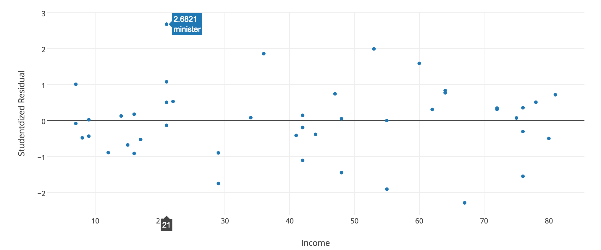
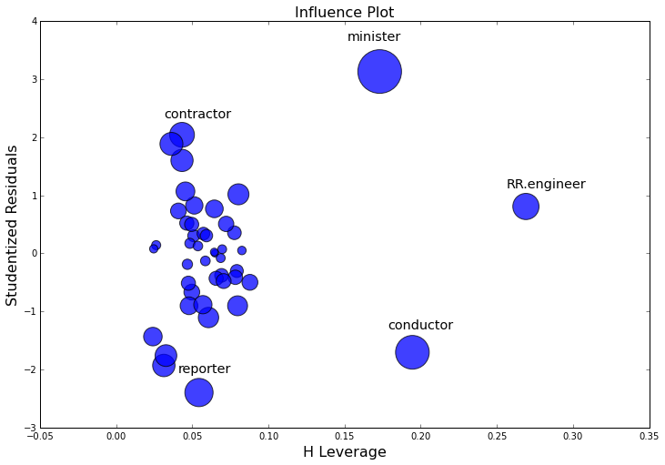

Include your answers to this morning's exercises in `individual.py`.

## Part 1: Linear Regression Diagnostics

The linear regression model makes a number of assumptions about the data, including 

- **Homoscedasticity of residuals**
- **Normal distribution of residuals**
- **Lack of multicollinearity among features**
- **Independence of the observations (For example, independence assumption violated if data is a time series)**

Since the results of the regression model depend on these statistical assumptions, the 
results of the regression model are only correct if our assumptions hold (at least approximately).

<br>

This morning we will be exploring two datasets: `prestige` and `ccard`. Below is a description of the 2 datasets.

* `prestige` _(From previous Linear Algebra/EDA afternoon)_
    - Prediction of the prestige of a job
    - Dependent variable: `prestige`
    - Independent variables: `income`, `education`
    - Code to load data set into dataframe:
  
  ```python
  import statsmodels.api as sm
  prestige = sm.datasets.get_rdataset("Duncan", "car", cache=True).data
  ```
   
* `ccard`
    - Prediction of the average credit card expenditure
    - Dependent variable: `AVGEXP`
    - Independent variables: `AGE`, `INCOME`, `INCOMESQ` (`INCOME^2`), `OWNRENT`
    - Code to load data set into dataframe:
  
  ```python
  credit_card = sm.datasets.ccard.load_pandas().data
  ```

<br>

1. Explore the dataset with a [scatter_matrix](http://pandas.pydata.org/pandas-docs/version/0.15.0/visualization.html#visualization-scatter-matrix) and a [boxplot](http://pandas.pydata.org/pandas-docs/stable/generated/pandas.DataFrame.boxplot.html).
    * (You can skip `prestige` if you did so on previous day)
   
   Fit a linear regression model to each of the datasets using `statsmodels`. Print and examine the summaries of the models. 

2. Plot the studentized residuals against the fitted y-values. Why do we need to use the studentized residuals as opposed to just the residuals?
   
   **Hint:** 
   - Use the `outlier_test` function to get the studentized residuals 
   - `model.outlier_test()['student_resid']`  # `model` refers to the fitted model using OLS in statsmodels
   
3. By inspecting the residual plots, which model is more likely to have **heteroscedastic** residuals? Explain 
   what heteroscedasticity means.

   The most common practice for identifying heteroscedasticity is to visually inspect the residual plot. In addition, the 
   [Goldfeld-Quandt](http://statsmodels.sourceforge.net/devel/generated/statsmodels.stats.diagnostic.HetGoldfeldQuandt.html#statsmodels.stats.diagnostic.HetGoldfeldQuandt) 
   test evaluates the p-value under the null of homoscedasticity.  See the docstring for `scipy.stats.diagnostic.het_goldfeldquandt` for more info.

   

4. One of the most common treatments to reducing heteroscedasticity is to take the log of the response variable, especially 
   if the distribution of the response variable is skewed. Take the log of `AVGEXP` in `ccard` data. Re-fit the model,
    re-plot the residuals, and re-run the Goldfeld-Quandt test. 
   
   **More advanced methods to treat heteroscedasticity (For your reference):**
   - Stratify the data and build multiple models (e.g. `low expenditure` and `high expenditure` models)
   - [Robust regression models](http://en.wikipedia.org/wiki/Robust_regression#Heteroscedastic_errors).

5. To test if the residuals are normally distributed, the common practice is to use the 
   [Q-Q plot](http://statsmodels.sourceforge.net/devel/generated/statsmodels.graphics.gofplots.qqplot.html).
   The Q-Q plot plots the quantile of the normal distribution against that of the studentized residuals and checks
   for alignment of the quantiles.
    
   Make Q-Q plots for the studentized residuals of the `prestige` and `ccard` (before `log` transform)
   models. Also use the [**Jarque-Bera**](http://en.wikipedia.org/wiki/Normality_test) test (already in model summary) to
   evaluate normality of the residuals. Apply the `log` transform to `AVGEXP` in `ccard` and repeat the plot and the JB test.
   What do you observe?
   
6. Explain what **multicollinearity** means and how it would affect the interpretation of the beta coefficients?  
   Comment on the level of multicollinearity of the `prestige` and `ccard` models by examining the **Condition Number**
   (included in model summary). As a rule of thumb, a condition number > 30 indicates multicollinearity between the features.
   
   Furthermore, we can use the 
   [**Variance Inflation Factor (VIF)**](http://statsmodels.sourceforge.net/devel/generated/statsmodels.stats.outliers_influence.variance_inflation_factor.html#statsmodels.stats.outliers_influence.variance_inflation_factor) 
   to measure how collinear a particular feature is with the rest of the features. As a rule of thumb, a VIF > 10 indicates 
   the feature is collinear with at least one other feature.
   
   **Hint:**
   - `variance_inflation_factor` takes a matrix of features (numpy matrix, not pandas dataframe) and the column index of the
     feature the VIF is to be calculated
   - Write a function that loops through and calculates the VIF for each of the features
   
## Part 2: Outlier Detection 

Often times, we are interested in detecting points that are poorly captured by the linear model (outliers). 

**Use only the `prestige` dataset to answer the questions below**.

1. Plot (use Plotly if you like, check out "offline mode" [here](https://plot.ly/python/getting-started/)) your residual plot for the `prestige` dataset (fitted y-value against studentized residuals). 
   Identify and note the points that are more than `2 / -2` studentized residuals. 

   
   
2. Plot the x-variables (`income` and `education` respectively) against the studentized residuals. Examine the outliers 
   you have identified in `1.` in the plots and explain why the points are identified as outliers 

   
   

3. In `1.` and `2.`, we looked at outliers and their sources.  Furthermore, we may be especially interested in [influential](http://onlinestatbook.com/2/regression/influential.html) outliers that skew the model significantly (i.e. the model (betas) changes drastically upon removal of these points).  Make the 
   [influence plot](http://statsmodels.sourceforge.net/devel/generated/statsmodels.graphics.regressionplots.influence_plot.html#statsmodels.graphics.regressionplots.influence_plot)
   and identify the outliers, the influential points, and the outliers with high influence (the most potent combination!). 

   To get a better sense of influence, you can read about leverage [here](http://en.wikipedia.org/wiki/Leverage_%28statistics%29). 
    


   
   
4. Remove the influential (high leverage) points identified in `3.` and re-fit the model. Describe the differences 
   you observe in the beta coefficients of the new model.


