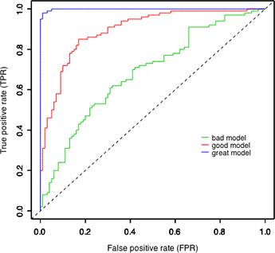
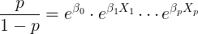
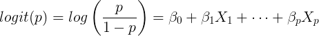
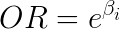
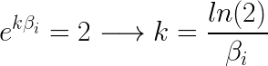

## Part 1: ROC Curve 

One of the best ways to evaluate how a classifier performs is an ROC curve. (http://en.wikipedia.org/wiki/Receiver_operating_characteristic) 



To understand what is actually happening with an ROC curve, we can create one ourselves.  Here is pseudocode to plot it.

The `probabilities` are values in (0,1) returned from Logistic Regression. The standard default threshold is 0.5 where 
0-0.5 values are interpreted as the negative class and 0.5-1 values are predicted as the positive class.

The `labels` are the true values.

```
function ROC_curve(probabilities, labels):
    Sort instances by their prediction strength (the probabilities)
    For every instance in increasing order of probability:
        Set the threshold to be the probability
        Set everything above the threshold to the positive class
        Calculate the True Positive Rate (aka sensitivity or recall)
        Calculate the False Positive Rate (1 - specificity)
    Return three lists: TPRs, FPRs, thresholds
```

Recall that the *true positive rate* is

```
 number of true positives     number correctly predicted positive
-------------------------- = -------------------------------------
 number of positive cases           number of positive cases
```

and the *false positive rate* is

```
 number of false positives     number incorrectly predicted positive
--------------------------- = ---------------------------------------
  number of negative cases           number of negative cases
```

You're going to be implementing the `roc_curve` function.

Here's some example code that you should be able to use to plot the ROC curve with your function. This uses a fake dataset.

```python
from sklearn.datasets import make_classification
from sklearn.linear_model import LogisticRegression
import matplotlib.pyplot as plt
from sklearn.model_selection import train_test_split

X, y = make_classification(n_features=2, n_redundant=0, n_informative=2,
                           n_clusters_per_class=2, n_samples=1000)
X_train, X_test, y_train, y_test = train_test_split(X, y)

model = LogisticRegression()
model.fit(X_train, y_train)
probabilities = model.predict_proba(X_test)[:, 1]

tpr, fpr, thresholds = roc_curve(probabilities, y_test)

plt.plot(fpr, tpr)
plt.xlabel("False Positive Rate (1 - Specificity)")
plt.ylabel("True Positive Rate (Sensitivity, Recall)")
plt.title("ROC plot of fake data")
plt.show()
```

1. Write an ROC curve function to compute the above in `roc_curve.py`.

    It should take as input the predicted probabilities and the true labels.

2. Run the above code to verify that it's working correctly. You can also validate your correctness against [scikit-learns built-in function](http://scikit-learn.org/stable/modules/generated/sklearn.metrics.roc_curve.html).

3. Let's see how the roc curve looks on a real dataset. We're going to use the FICO Loan dataset. We want to predict whether or not you get approved for a loan of 12% interest rate given the FICO Score, Loan Length and Loan Amount. Here's the code to load the data:

    ```python
    import pandas as pd
    df = pd.read_csv('data/loanf.csv')
    y = (df['Interest.Rate'] <= 12).values
    X = df[['FICO.Score', 'Loan.Length', 'Loan.Amount']].values
    ```

    Make sure to split your data into training and testing using sklearn's [train_test_split()](http://scikit-learn.org/stable/modules/generated/sklearn.cross_validation.train_test_split.html).

## Part 2: Data Exploration: Graduate School Admissions

The data we will be using is admission data on Grad school acceptances.

* `admit`: whether or not the applicant was admitted to grad. school
* `gpa`: undergraduate GPA
* `gre`: score of GRE test
* `rank`: prestige of undergraduate school (1 is highest prestige, ala Harvard)

We will use the GPA, GRE, and rank of the applicants to try to predict whether or not they will be accepted into graduate school.

Before we get to predictions, we should do some data exploration.

1. Load in the dataset into pandas: `data/grad.csv`.

2. Use the pandas `describe` method to get some preliminary summary statistics on the data. In particular look at the mean values of the features.

3. Use the pandas `crosstab` method to see how many applicants from each rank of school were accepted. You should get a dataframe that looks like this:

    ```
    rank    1   2   3   4
    admit
    0      28  ..  ..  ..
    1      33  ..  ..  ..
    ```

    Make a bar plot of the percent of applicants from each rank who were accepted. You can do `.plot(kind="bar")` on a pandas dataframe.

4. What does the distribution of the GPA and GRE scores look like? Do the distributions differ much?

    Hint: Use the pandas `hist` method.

5. One of the issues with classification can be unbalanced classes. What percentage of the data was admitted? Do you think this will be a problem?


## Part 3: Predicting Graduate School Admissions

Now we're ready to try to fit our data with Logistic Regression.

We're going to start with statsmodel's implementation of [Logistic Regression](http://statsmodels.sourceforge.net/stable/generated/statsmodels.discrete.discrete_model.Logit.html) and then move onto sklearn's [LogisticRegression](http://scikit-learn.org/stable/modules/generated/sklearn.linear_model.LogisticRegression.html).

1. Use statsmodels to fit a [Logistic Regression](http://statsmodels.sourceforge.net/stable/generated/statsmodels.discrete.discrete_model.Logit.html).

2. Use the `summary` method to see your results. Look at the p-values for the beta coefficients. We would like these to be significant. Are they?

3. Once we feel comfortable with our model, we can move on to cross validation. We no longer will need all the output of statsmodels so we can switch to sklearn. Use sklearn's [KFold cross validation](http://scikit-learn.org/stable/modules/generated/sklearn.model_selection.KFold.html) and [LogisticRegression](http://scikit-learn.org/stable/modules/generated/sklearn.linear_model.LogisticRegression.html) to calculate the average accuracy, precision and recall.

    Hint: Use sklearn's implementation of these scores in [sklearn.metrics](http://scikit-learn.org/stable/modules/classes.html#module-sklearn.metrics).

4. The `rank` column is ordinal where we assume an equal change between ranking levels, but we could also consider it to be more generally categorical. Use panda's [get_dummies](http://pandas.pydata.org/pandas-docs/stable/generated/pandas.core.reshape.get_dummies.html) to binarize the column.

5. Compute the same metrics as above. Does it do better or worse with the rank column binarized?

    From now on, use the version of the feature matrix that performed the best.

6. Make a plot of the ROC curve (using your function defined in Part 1).

7. Is it possible to pick a threshold where TPR > 60% and FPR < 40%? What is the threshold?

    *Note that even if it appears to be in the middle of the graph it doesn't make the threshold 0.5.*

8. Say we are using this as a first step in the application process. We want to weed out clearly unqualified candidates, but not reject too many candidates. What might be a good choice of threshold?

    There isn't a single correct answer, so explain your choice!


## Part 4: Interpreting the beta coefficients with the Odds Ratio

One thing that is often lost when talking about logistic regression is the idea of the odds ratio, or rather the probabilistic interpretation of the model. For this next part we will get hands on with the odds ratio.

The ***odds*** are defined as the product of the exponential of each coefficient.



This represents the odds of being admitted over not being admitted.

However, to bring the logistic regression function into the form that resembles a linear predictor, we focus on the logit function known as the logodds.



Note: The base chosen in statistics for the logarithm is traditionally `base e` and the natural logarithm used.

With this transformation, the coefficients of the logistic regression can be interpreted similarly to the coefficients of linear regression; however, they correspond to the change in logodds, which does not have an intuitive meaning.  Luckily, we can calculate the Odds Ratio by exponentiating the beta coefficients

 

The Odds Ratio represents the relative change in odds due to a 1-unit change in the feature.  For instance, the odds that Secratariat will win the Kentucky Derby are 3 times greater when its a dry track than if its been raining.


1. Fit a Logistic Regression model on all the data. What are the beta coefficients? You should have 3 values.

2. Compute the odds ratio from a one unit change in each feature. 

3. Write a sentence for each of the three features that sounds like this:

    *Increasing the GPA by 1 point increases the odds by a factor of ??.*

    Make sure you think about each statement. Does it make sense?

4. What change is required to double my chances of admission? Treat each of the features individually.

    e.g. Increasing the GPA by ?? points doubles the odds.

    *Hint: You need to find the value of k in the following equation.*

    


## Part 5: Predicted Probabilities

Now let's actually play with our data to verify what we calculated above with the Odds Ratio.

1. Create a new feature matrix which has four rows. It should have each of the four possible values for the rank and keep the GRE and GPA values fixed. Use the mean value as a reasonable value to fix them at.

2. Use the same fitted model from Part 4 and then use the model's `predict_proba` method to compute the predicted probabilities of this fake feature matrix. Also include the odds (`p/(1-p)`).

    Note that it gives a numpy array with 2 columns. The first column is the probability that it belongs to class 0 and the second is the probability that it belongs to class 1. These will always sum to 1, so with 2 classes, this is redundant. In this case, the second column is the one we should use since it has the probabilities we expect.

    You should end up with something like this:

    ```
    rank: 1, probability: 0.517495, odds: 1.07251738
    ```

    Does the ratio of odds equal what you computed above?

3. Make a plot of the rank vs the probability.

4. Now, make a plot of the rank vs the odds (`p/(1-p)`).

5. Since a linear change in rank changes the probability by a multiplicative factor, we should really be graphing rank vs the log-odds.

    The slope of this line should be the beta coefficient. Eyeball calculating the slope to confirm this.

6. Do the same analysis (#1-5) with the GRE and GPA scores. Each time, create a feature matrix with the other two columns fixed at the mean and every possible value of the column in question.

## Extra credit

This is the future!  No one goes to physical schools any more and MOOCs rule the world.

Harvard and MIT have [released](http://newsoffice.mit.edu/2014/mit-and-harvard-release-de-identified-learning-data-open-online-courses) a great dataset around engagement statistics for their MOOC courses. The data is in `data/mooc.csv` and a description of the dataset can be found in `data/mooc.pdf`.

One of the biggest issues with MOOCs is engagement. We will try to predict the probability of 'engagement' of a student given all the other columns.  We will define engagement here as either: `explored == 1 OR certified == 1`.

1. First explore all of the classes, what are the rates of certified and explored for each.  Which one has the highest percent of each?  How about for engagement as defined above?

2. Build a column labeled 'engagement' that represents this definition.

3. Try to predict the engagement of a student.  Remember we do not want to use any columns that we will not have before a student has completed a course in a live scenario (i. e. `grade`, `viewed`, `explored`, `certified`, etc.)

4. Plot a confusion matrix and an ROC curve to evaluate your model

5. Which of these features is most important for engagement?

6. How does recall compare to precision?
