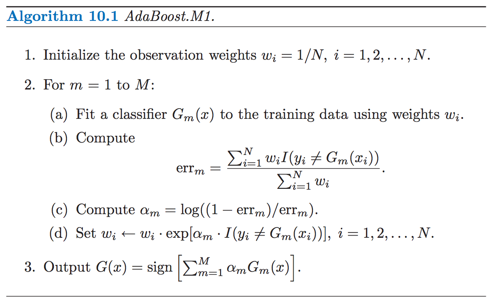
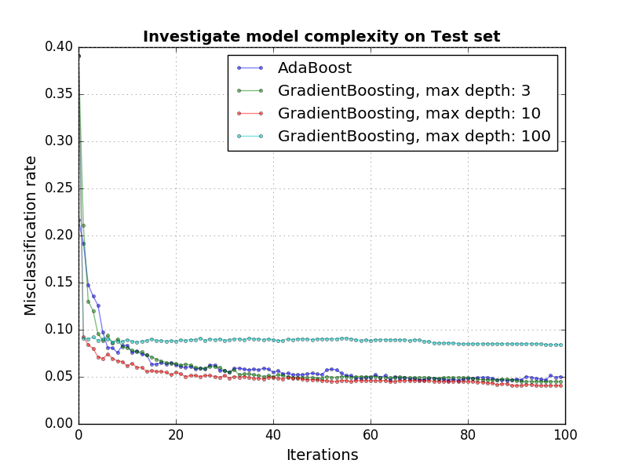
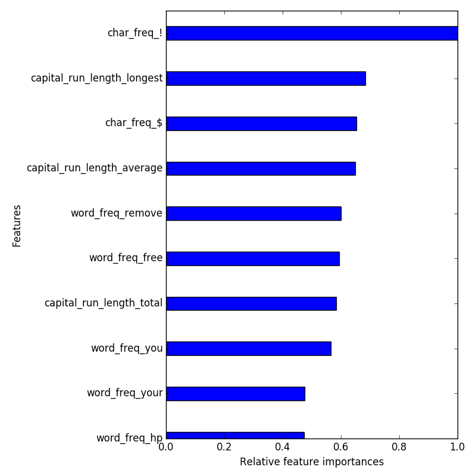
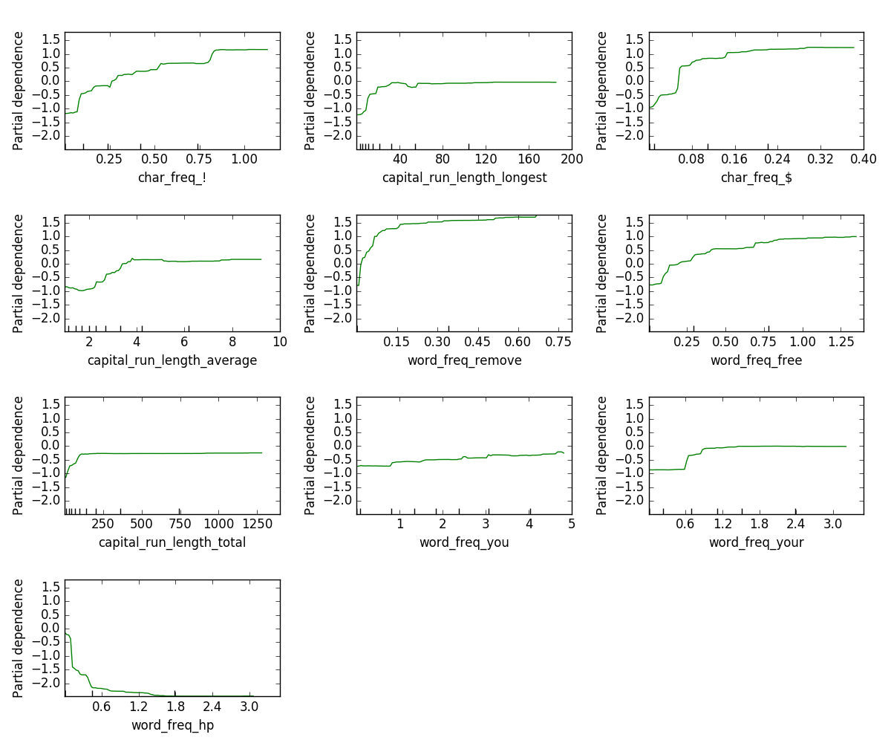
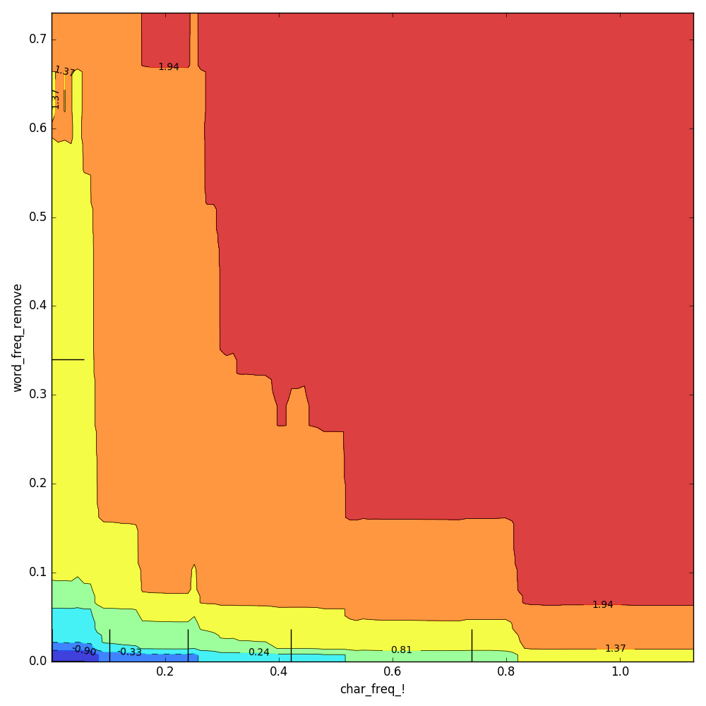
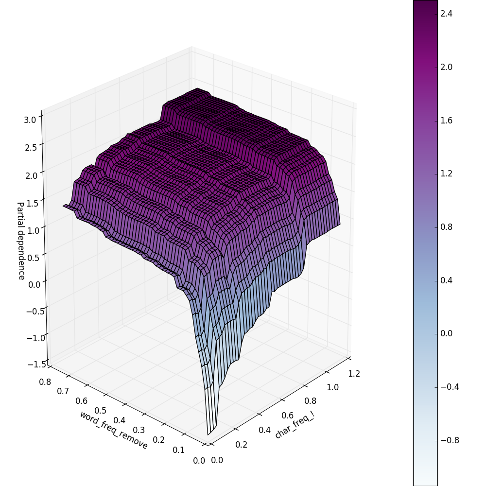

**Include your code and answers in** `pair.py`.

## Part 0: Intro to AdaBoost Classifier
This morning we have encountered `AdaBoostRegressor` and its gradient
descent variant, `GradientBoostingRegressor`. The base form of AdaBoost was
introduced in 1995 as an ensemble classifier, `AdaBoostClassifier`.
Understanding `AdaBoostClassifier` is regarded as the defacto
introduction to the world of seemingly endless variants of boosting algorithms
([refs](readings)). To gain a more entrenched understanding of boosting
in general, I would recommend [this](readings/explaining_boosting.pdf).

<br>

Today we're going to implement the pseudocode below:



<br>

## Part 1: Implementing the AdaBoost Classifier
Here we will build a simplified version of `AdaBoostClassifier`. In this case,
our classifier, `AdaBoostBinaryClassifier`, will only predict binary outcomes.
The starter code is in the [src](src) folder. The `boosting.py` file contains the
core functions you would have to implement this afternoon. Fill in the rest depending
on your progress. Remember it is more important to understand the intuition of the algorithm
than get to the end of the exercise.

<br>

We're going to be using a spam dataset. It's in the [data](data) folder. You can see the feature names [here](https://archive.ics.uci.edu/ml/machine-learning-databases/spambase/spambase.names).

Here's how you should be able to run your code after you're finished:

```python
from boosting import AdaBoostBinaryClassifier
import numpy as np
from sklearn.model_selection import train_test_split

if __name__=='__main__':
   data = np.genfromtxt('data/spam.csv', delimiter=',')

   y = data[:, -1]
   X = data[:, 0:-1]

   X_train, X_test, y_train, y_test = train_test_split(X, y)

   my_ada = AdaBoostBinaryClassifier(n_estimators=50)
   my_ada.fit(X_train, y_train)
   print "Accuracy:", my_ada.score(X_test, y_test)
```

1. Take a look at the `__init__` method in `src/boosting.py`. You shouldn't need to change anything here. Note how we are creating Decision Trees that are just stumps! (max depth is 1).

2. Implement the `_boost` method. This will be doing steps (a)-(d) in the AdaBoost.M1 algorithm inside the for loop.

    Because we need many copies of the estimator, the first step is to clone it. This code is given for you.

    In this function `sample_weight` refers to the *wi*'s in the above description of the algorithm.

    You will need to do these steps:

    * Fix the Decision Tree using the weights. You can do this like this: `estimator.fit(X, y, sample_weight=sample_weight)`
    * Calculate the error term (`estimator_error`)
    * Calculate the alphas (`estimator_weight`)
    * Update the weights (`sample_weight`)

3. Implement the `fit` method. This is steps 1 and 2 from the AdaBoost.M1 algorithm.

    You should have a for loop that calls your `_boost` method `n_estimators` times. Make sure to save all the estimators in `self.estimators_`. You also need to save all the estimator weights in `self.estimator_weight_`.

4. Implement the `predict` method. This is step 3 from the algorithm.

    Note that the algorithm considers the predictions to be either -1 or 1. So once you get predictions back from your Decision Trees, change the 0's to -1's.

5. Implement the `score` method.

    This should call the predict method and then calculate the accuracy.

6. Load the file `data/spam_data.csv` into a dataframe. Use `train_test_split` to create test and train sets.
   Train your implementation of `AdaBoostBinaryClassifier` on the train set and get the train and test accuracy scores.
   Compare your results with sklearn's [AdaBoostClassifier](http://scikit-learn.org/stable/modules/generated/sklearn.ensemble.AdaBoostClassifier.html).
   You should get approximately the same accuracy.

   **Review the steps to implement the algorithm and make sure you (and your partner) have understood the underpinnings of boosting.**  

<br>

## Part 2: Estimator Complexity

One of the assumptions of boosting is having weak classifiers at each of the boosting round. More complex classifiers would can lead to "harder" fits that make performance on a test set worse. Use sklearn's implementations from here on since that is what you would do in practice.

<br>

1. Refer to the function (`stage_score_plot`) you have implemented [this morning](individual.md). Tweak the function
   to calculate and plot only the test misclassification from the estimator in each boosting round. Remember to use
   the `staged_predicted` function that comes with the `AdaBoostClassifier` and `GradientBoostingClassifier`.

2. Use `stage_score_plot` to plot the test error curve for `AdaBoostClassifier` and `GradientBoostingClassifier`.
   In addition, include two more `GradientBoostingClassifier` models where the `max_depth` argument is `10` and `100`
   respectively.

   

3. Compare the curves and comment on what is happening at `max_depth=100`

4. GridSearch and tune your `GradientBoostingClassifier`.

<br>

## Part 3: Feature importance and Partial Dependency Plots

`GradientBoostingClassifier` has support for feature importance which informs how much each of the features explain
the variance in the data. Partial Dependency Plots give you more detailed information about the relationship
between each of the features and the response.


<br>

1. Make a feature importance plot by calling `feature_importances_` of your `GradientBoostingClassifier`.
   Plot only the top 10 features which explain the most variance in the data. You will need to use `numpy.argsort()`
   to order the feature importances and get the name of the top 10 most important features. Normalize the feature
   importances by the maximum feature importance. Use `barh` in `matplotlib` to make the plot. Below is the snippet
   for the plotting functionality.

   ```python
   import matplotlib.pyplot as plt
   import numpy as np

   fig = plt.figure(figsize=(10, 10))
   x_ind = np.arange(feat_import.shape[0])
   plt.barh(x_ind, feat_import, height=.3, align='center')
   plt.ylim(x_ind.min() + .5, x_ind.max() + .5)
   plt.yticks(x_ind, colnames, fontsize=14)
   ```

   

2. Use [`plot_partial_dependence`](http://scikit-learn.org/stable/auto_examples/ensemble/plot_partial_dependence.html)
   to make partial dependence plot for the top 10 most important features. The `feature` argument should be the
   indexes of the top 10 features from the `numpy.argsort()` you have done in `1.`. The `feature_names` argument should
   be all the column names of the dataframe containing the spam data. Highlight and explain interesting trends you
   observe in the PDP plots.

   

3. You can also examine the interaction between 2 variables by providing a list of tuples of 2 features for the `feature` argument
   in `plot_partial_dependence`.

   

4. Furthermore, you can show the interaction of 2 variables and their joint relationship with the response variable by plotting
   a 3-D surface. Adapt the code for this [example](http://scikit-learn.org/stable/auto_examples/ensemble/plot_partial_dependence.html).
   Do not worry about completely dissecting the code. It is a very important skill to be able to adapt other people's code
   quickly to perform a task. Make a few plots where you may suspect there is an interaction and interpret the plots.

   
